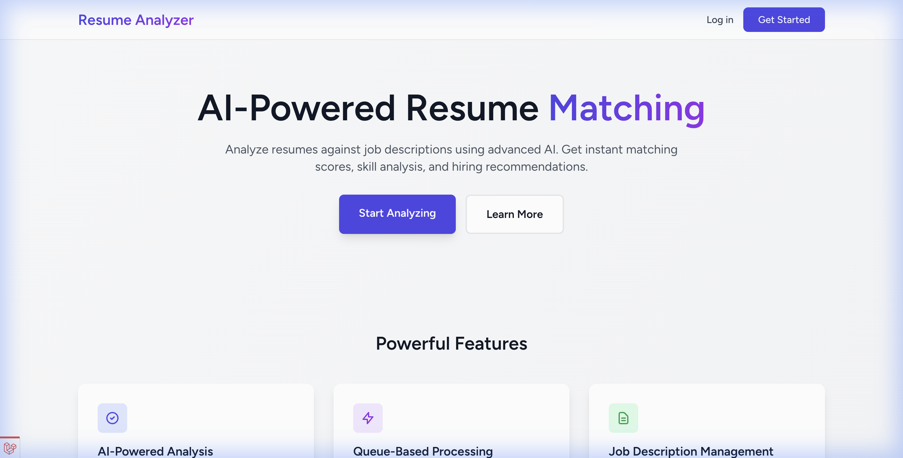
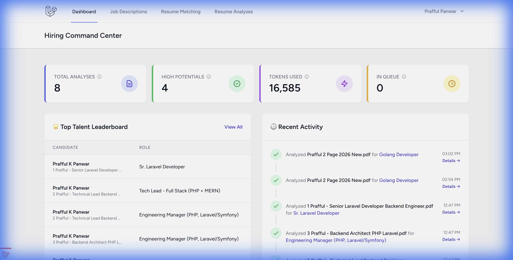
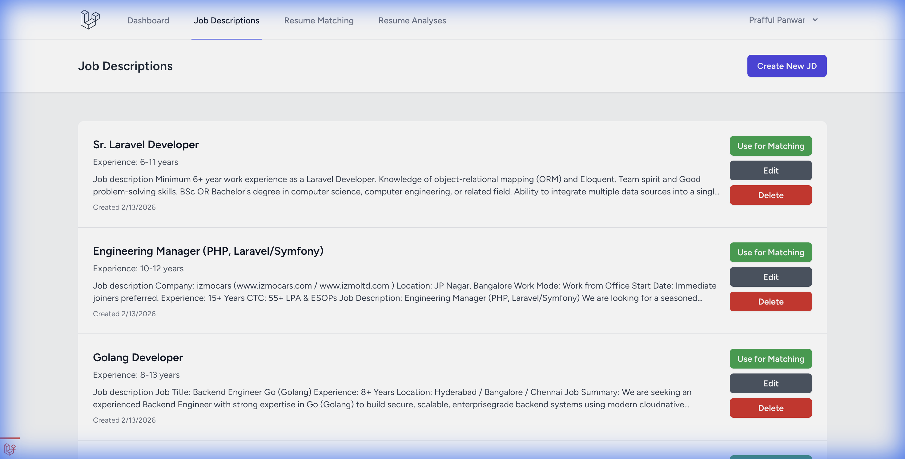
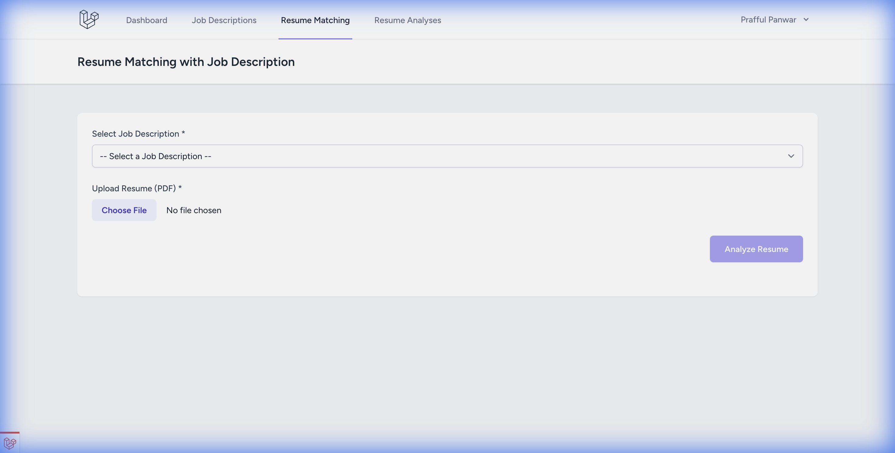
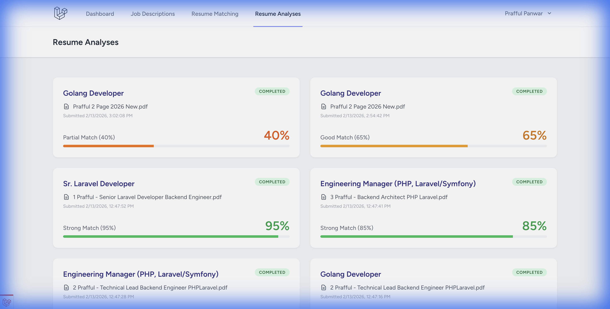
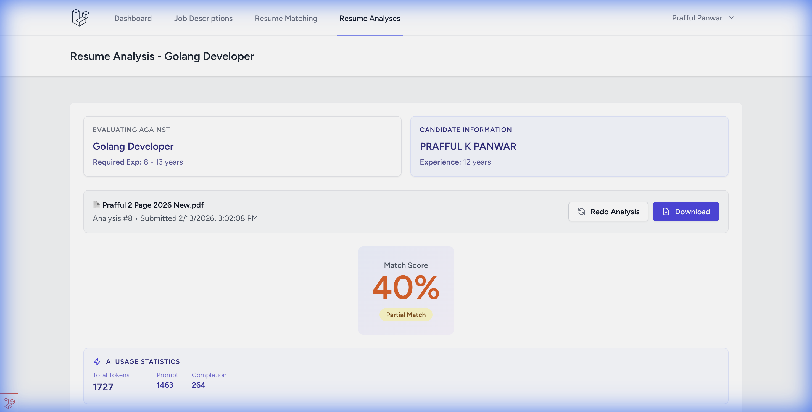

# Resume Analyzer 📄🔍

Resume Analyzer is an AI-powered Laravel application designed to streamline the recruitment process. It leverages Large Language Models (LLMs) to analyze resumes, extract structured data, and match candidates against specific job descriptions. The application is designed to be **model-agnostic**, allowing you to use any LLM provider (Ollama, OpenAI, Anthropic, etc.) for testing and production.

## Product Walkthrough


## 🚀 Application Gallery & Features

### Application Tour








- **Resume Matching**: Upload a PDF resume and compare it against a Job Description (JD) to get a compatibility score and analysis (Skills, Experience, Education match).
- **Queue-Based Processing**: Analysis runs in the background using **Laravel Horizon** with a dedicated `resume-analysis` queue — fully isolated from notification delivery for better reliability.
- **Real-time Notifications**: Instant in-app toast notifications powered by **Laravel Reverb** (WebSockets). No polling — the UI is notified the moment a job completes or fails.
- **Slack Notifications**: When a job finishes, a rich Slack message is sent to your configured webhook with the job role, match score (or error), and status — colour-coded green or red.
- **Auto-Retry Mechanism**: Failed analysis jobs are automatically retried with exponential backoff (1 min → 2 min → 5 min).
- **Token Usage Tracking**: Detailed statistics (Prompt, Completion, and Total tokens) are saved for every analysis and attempt.
- **Job Description Management**: Create and manage reusable JDs.
- **Secure & Private**: Filename sanitization and support for local AI processing (via Ollama) ensure data privacy.
- **Authorization**: Policy-based access control (`JobDescriptionPolicy`, `ResumeAnalysisPolicy`) ensures users can only view, edit, and delete their own records.

## 🛠️ Tech Stack

- **Backend**: Laravel 12, PHP 8.4
- **Frontend**: Vue.js 3, Inertia.js, Tailwind CSS
- **AI/LLM**: Powered by the **[Laravel AI SDK](https://github.com/laravel/ai)** for model-agnostic integration (Ollama, OpenAI, Anthropic, etc.)
- **Queue**: Redis + **Laravel Horizon** (dedicated supervisors per queue)
- **WebSockets**: **Laravel Reverb** for real-time browser push notifications
- **Database**: MySQL
- **Monitoring**: Laravel Telescope (local), Laravel Nightwatch (production)
- **Code Quality**: Rector, Larastan (Level 8), Pest, Pint, GrumPHP

## 📦 Installation

1.  **Clone the repository**

    ```bash
    git clone https://github.com/prafful-panwar/ai-resume-analyzer.git
    cd ai-resume-analyzer
    ```

2.  **Install PHP Dependencies**

    ```bash
    composer install
    ```

3.  **Install Node Dependencies**

    ```bash
    npm install
    ```

4.  **Environment Setup**

    ```bash
    cp .env.example .env
    php artisan key:generate
    ```

5.  **Configure Database, Queue & WebSockets**
    Update your `.env` file:

    ```env
    DB_CONNECTION=mysql
    DB_HOST=127.0.0.1
    DB_PORT=3306
    DB_DATABASE=resume_analyzer
    DB_USERNAME=root
    DB_PASSWORD=

    QUEUE_CONNECTION=redis
    REDIS_HOST=127.0.0.1
    REDIS_PORT=6379

    REVERB_APP_ID=your-app-id
    REVERB_APP_KEY=your-app-key
    REVERB_APP_SECRET=your-app-secret
    REVERB_HOST=localhost
    REVERB_PORT=8080
    REVERB_SCHEME=http

    # Optional — leave blank to disable Slack notifications
    SLACK_NOTIFICATIONS_WEBHOOK_URL=
    ```

    > **Note:** Redis must be running. Example installations:
    >
    > - macOS: `brew install redis && brew services start redis`
    > - Docker: `docker run --name redis -p 6379:6379 -d redis`
    > - [Official Redis Installation Docs](https://redis.io/docs/install/install-redis/)

6.  **Run Migrations**

    ```bash
    php artisan migrate
    ```

7.  **Setup AI (Ollama)**
    Ensure [Ollama](https://ollama.ai) is installed and running locally.
    ```bash
    ollama pull mistral
    ```
    _(Note: You can configure the model in `config/ai.php` or `.env` if variable is exposed)_

## 🏃‍♂️ Running the Application

A single command starts everything — the web server, Horizon, Reverb, Vite, and log tailing:

```bash
composer run dev
```

This starts:

| Process                    | What it does                                   |
| -------------------------- | ---------------------------------------------- |
| `php artisan serve`        | Laravel web server on `http://127.0.0.1:8000`  |
| `php artisan horizon`      | Queue supervisor (Horizon) managing all queues |
| `php artisan reverb:start` | WebSocket server on `ws://localhost:8080`      |
| `npm run dev`              | Vite asset bundler with HMR                    |
| `php artisan pail`         | Real-time log tailing in the terminal          |

Visit `http://127.0.0.1:8000` to access the application.

## 📊 Queue Architecture (Horizon)

Jobs are isolated across three dedicated queues, each with its own supervisor:

| Queue             | Jobs                               | Timeout |
| ----------------- | ---------------------------------- | ------- |
| `resume-analysis` | `AnalyzeResumeJob` (AI processing) | 300s    |
| `notifications`   | Broadcast & Slack notifications    | 30s     |
| `default`         | Telescope, misc                    | 60s     |

**Horizon dashboard:** `http://127.0.0.1:8000/horizon` — monitor pending, completed, and failed jobs in real time.

## 🔔 Notification System

When a resume analysis job **completes or fails**, the user is notified through multiple channels simultaneously:

| Channel                | Delivery                       | What you see                                                    |
| ---------------------- | ------------------------------ | --------------------------------------------------------------- |
| **In-app (WebSocket)** | Instant — pushed via Reverb    | Toast notification in the browser                               |
| **Database**           | Persistent                     | Stored in `notifications` table                                 |
| **Slack**              | Instant — via Incoming Webhook | Rich colour-coded attachment with job role, match score / error |

To enable Slack, set `SLACK_NOTIFICATIONS_WEBHOOK_URL` in your `.env`. Leave it blank to disable.

## 🛡️ Code Quality & Testing

This project adheres to strict code quality standards, enforced automatically via **GrumPHP** pre-commit hooks and the **Code Shield** suite.

### The "Code Shield"

We have a unified command that runs all quality checks. You **must** pass this before committing code.

```bash
composer run code-shield
```

This command runs:

1.  **Pint** 🎨: Fixes code style to follow PSR-12 and Laravel standards.
2.  **Rector** ♻️: Automatically refactors code (Quality, Dead Code, Early Returns, Auto-Imports).
3.  **Larastan** 🔍: Performs strict static analysis (Level 8) to catch type errors.
4.  **Pest** 🧪: Runs the test suite (Unit & Feature tests).
5.  **Type Coverage** 📊: Enforces **100% type coverage**.
6.  **ESLint** 🧹: Lints Vue.js and JavaScript files.

## 📖 Usage Guide

### 1. Resume Matching (Main Feature)

1.  Go to **Job Descriptions** and create a new JD (e.g., "Senior Laravel Developer").
2.  Navigate to **Resume Matching**.
3.  Select the Job Description you just created.
4.  Upload a candidate's Resume (PDF).
5.  Click **Analyze**.
6.  The job is queued. A **real-time toast notification** will pop up the moment analysis completes — no page refresh needed. You'll also receive a Slack message if configured.

### 2. Viewing, Retrying & History

- **View History**: Go to **Resume Analyses** to see a list of all checks.
- **Retry Failed Jobs**: If a job fails, click the **Retry** button on the detail page to re-queue it.
- **Redo Analysis (Force Retry)**: If you're not satisfied with a completed analysis, click **Redo Analysis** to force a re-run.
- **Audit Logs**: All previous attempts (failed or overwritten) are saved in the `resume_analysis_logs` table for audit purposes.

## 🚀 Future Roadmap: Vector Search & RAG

We are transitioning to a **Retrieval-Augmented Generation (RAG)** architecture to improve accuracy and scalability.

- **Semantic Matching**: Beyond keywords, the system will understand context (e.g., "Frontend Developer" matching "React Specialist").
- **Cost Efficiency**: By chunking resumes and only sending relevant snippets to the LLM, we significantly reduce token usage.
- **Native Vector Storage**: Leveraging MySQL JSON vectors for local-first, high-performance similarity searches.

---

## 🧠 LLM Expert Advice & Best Practices

As an LLM architect, here are the key considerations for achieving production-grade results with this application:

### 1. Accuracy vs. Cost (Model Selection)

- **For Development/Privacy**: [Ollama](https://ollama.ai) with **Mistral** or **Llama 3** is excellent for testing logic locally and ensuring no data leaves your machine.
- **For High-Accuracy Production**: Use premium models like **GPT-4o** or **Claude 3.5 Sonnet**. Resume parsing involves nuanced extraction (e.g., distinguishing between a "Skill" mentioned in a project vs. a "Core Competency"). Free/Local models often struggle with these nuances or JSON formatting compared to larger, proprietary models.

### 2. Structured Output Enforcement

The application is built to handle structured JSON. Always ensure your prompt (in `AnalyzeResumeJob`) uses a clear schema. If you use OpenAI/Anthropic, consider enabling **Structured Outputs** or **JSON Mode** to prevent hallucinations.

### 3. Token & Context Management

Resumes can be surprisingly dense. If you upload very long PDFs, the token count can spike.

- **Tip**: This app extracts plain text from PDFs to minimize "noise" tokens (formatting/layouts), focusing the LLM's context window on the actual content.

### 4. Handling Hallucinations

Always review the "Analysis Logs". If the AI scores a candidate 90% but the summary looks generic, check if the model is hallucinating. This usually happens with smaller local models; upgrading to a larger model almost always fixes it.

### 5. Privacy & PII

Resumes contain PII (Phone numbers, Emails). If you are in a highly regulated industry:

- Use **Ollama** for 100% local processing.
- If using cloud APIs, ensure you have a Data Processing Agreement (DPA) in place.

---

## 🛡️ Security Note

- **Filename Sanitization**: Uploaded files are automatically sanitized to prevent path traversal and script injection attacks.
- **Validation**: Strict validation rules are applied to all inputs (MIME types, file sizes).
- **Authorization**: Every read, edit, and delete action is guarded by Laravel Policies — users can only access their own data.

## 🤝 Contributing

1.  Fork the repository
2.  Create your feature branch (`git checkout -b feature/amazing-feature`)
3.  **Run Code Shield** (`composer run code-shield`) to ensure all checks pass 🛡️
4.  Commit your changes (`git commit -m 'Add some amazing feature'`)
5.  Push to the branch (`git push origin feature/amazing-feature`)
6.  Open a Pull Request

## 📄 License

This project is open-sourced software licensed under the [MIT license](https://opensource.org/licenses/MIT).
